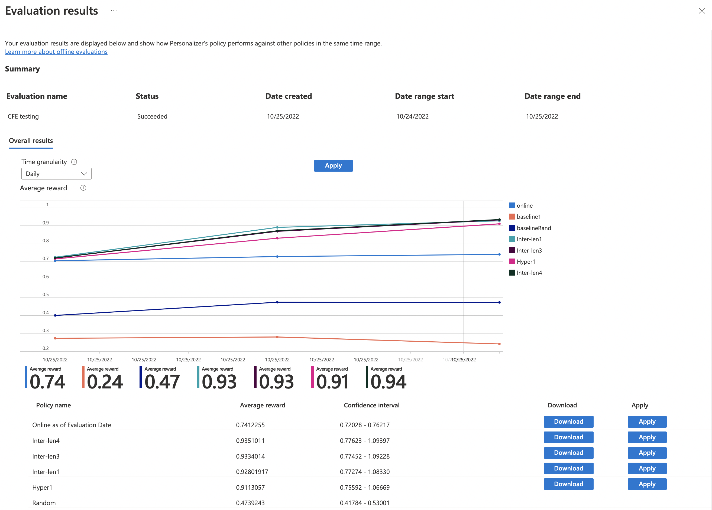

---
lab:
  title: Verwenden von KI Personalisierung mit Visual Studio Code-Notebooks zum Simulieren einer Schleife
---
> **Wichtig** Seit Herbst 2023 können keine neuen Personalisierung-Ressourcen mehr erstellt werden.

> **Hinweis** Um diese Übung abzuschließen, werden Sie ein [Azure-Abonnement](https://azure.microsoft.com/free?azure-portal=true) benötigen.

In dieser Übung verwenden Sie Azure KI Personalisierung mit Notebooks in Visual Studio Code, um eine Lernschleife zu simulieren.

## Erstellen einer Azure KI Personalisierung-Ressource mithilfe des Azure-Portals

1. Suchen Sie im Azure-Portal nach **Azure KI Services**. Wählen Sie dann in der Ergebnisliste unter **Personalisierung** die Option **Erstellen** aus.

   

1. Wählen Sie Ihr Abonnement aus, geben Sie einen Ressourcengruppennamen und einen Namen für Ihre Ressource ein. Wählen Sie für den Tarif **Free F0** aus.
1. Wählen Sie **Überprüfen + erstellen** aus, um Ihre Auswahl zu überprüfen, und wählen Sie dann **Erstellen** zum Erstellen Ihrer Ressource aus.
1. Wechseln Sie zu Ihrer neu erstellten Azure KI Personalisierung-Ressource, und kopieren Sie dann im Bereich „Schlüssel und Endpunkt“ den **Schlüssel** und den **Endpunkt**, und fügen Sie diese für die spätere Verwendung an einem sicheren Ort ein:

   

1. Wählen Sie im Navigationsbereich „Setup“ aus, und legen Sie dann die **Belohnungswartezeit** auf **10 Minuten** fest (sofern noch nicht festgelegt), und legen Sie die **Aktualisierungsfrequenz des Modells** auf **15 Sekunden** fest.
1. Wählen Sie **Speichern**.

## Notebook einrichten

1. Drücken Sie in Ihrem Visual Studio Code-Editor **STRG+UMSCHALT+P**, und wählen Sie **Erstellen: Neues Jupyter Notebook** aus.
1. Speichern Sie die Datei, und nennen Sie diese **my-notebook** auf Ihrem Gerät.
1. Jetzt müssen Sie die erforderlichen Erweiterungen installieren. Wählen Sie oben rechts im Notebook **Kernel auswählen** aus. Wählen Sie dann **Empfohlene Erweiterungen installieren/aktivieren** aus.

   

   > [!NOTE]
   > Wenn Sie dies bereits getan haben, werden Sie diese Option nicht sehen und können diesen Schritt überspringen.

1. Warten Sie, bis die Erweiterungen installiert sind, und wählen Sie dann **Python-Umgebungen...** in der erscheinenden Dropdownliste aus.
1. Wählen Sie dann die am meisten empfohlene Umgebung aus.

## Vorbereiten von Daten

Zum Zweck dieser Übung erstellen wir eine Liste der Benutzer*innen und eine Liste von Kaffeeprodukten, die wir als Basisdaten für unsere Azure KI Personalisierung verwenden können.

1. Kopieren Sie den folgenden JSON-Code in eine leere Datei, und speichern Sie diese Datei als `users.json` im gleichen Ordner wie Ihre Notebookdatei.

   ```json
   {
     "Alice": {
       "Sunny": {
         "Morning": "Cold brew",
         "Afternoon": "Iced mocha",
         "Evening": "Cold brew"
       },
       "Rainy": {
         "Morning": "Latte",
         "Afternoon": "Cappucino",
         "Evening": "Latte"
       },
       "Snowy": {
         "Morning": "Cappucino",
         "Afternoon": "Cappucino",
         "Evening": "Cappucino"
       }
     },
     "Bob": {
       "Sunny": {
         "Morning": "Cappucino",
         "Afternoon": "Iced mocha",
         "Evening": "Cold brew"
       },
       "Rainy": {
         "Morning": "Latte",
         "Afternoon": "Latte",
         "Evening": "Latte"
       },
       "Snowy": {
         "Morning": "Iced mocha",
         "Afternoon": "Iced mocha",
         "Evening": "Iced mocha"
       }
     },
     "Cathy": {
       "Sunny": {
         "Morning": "Latte",
         "Afternoon": "Cold brew",
         "Evening": "Cappucino"
       },
       "Rainy": {
         "Morning": "Cappucino",
         "Afternoon": "Latte",
         "Evening": "Iced mocha"
       },
       "Snowy": {
         "Morning": "Cold brew",
         "Afternoon": "Iced mocha",
         "Evening": "Cappucino"
       }
     },
     "Dave": {
       "Sunny": {
         "Morning": "Iced mocha",
         "Afternoon": "Iced mocha",
         "Evening": "Iced mocha"
       },
       "Rainy": {
         "Morning": "Latte",
         "Afternoon": "Latte",
         "Evening": "Latte"
       },
       "Snowy": {
         "Morning": "Cappucino",
         "Afternoon": "Cappucino",
         "Evening": "Cappucino"
       }
     }
   }
   ```

1. Kopieren Sie als Nächstes den folgenden Code und speichern ihn in einer Datei namens `coffee.json`:

   ```json
   [
     {
       "id": "Cappucino",
       "features": [
         {
           "type": "hot",
           "origin": "kenya",
           "organic": "yes",
           "roast": "dark"
         }
       ]
     },
     {
       "id": "Cold brew",
       "features": [
         {
           "type": "cold",
           "origin": "brazil",
           "organic": "yes",
           "roast": "light"
         }
       ]
     },
     {
       "id": "Iced mocha",
       "features": [
         {
           "type": "cold",
           "origin": "ethiopia",
           "organic": "no",
           "roast": "light"
         }
       ]
     },
     {
       "id": "Latte",
       "features": [
         {
           "type": "hot",
           "origin": "brazil",
           "organic": "no",
           "roast": "dark"
         }
       ]
     }
   ]
   ```

1. Kopieren Sie den folgenden Code und fügen ihn in eine Datei ein, und speichern Sie diese als `example-rankrequest.json`:

   ```json
   {
     "contextFeatures": [],
     "actions": [],
     "excludedActions": [],
     "eventId": "",
     "deferActivation": false
   }
   ```

## Festlegen Ihres Endpunkts und Schlüssels

1. Fügen Sie oben im Notebook den folgenden Code hinzu, um die erforderlichen Module einzuschließen:

   ```python
   import json
   import matplotlib.pyplot as plt
   import random
   import requests
   import time
   import uuid
   import datetime
   ```

1. Wählen Sie die Zelle aus, und wählen Sie dann die Schaltfläche „Ausführen“ links neben der Zelle aus:

   

   > [!NOTE]
   > Stellen Sie sicher, dass Sie bei jedem Auffüllen einer neuen Zelle die Schaltfläche „Ausführen“ auswählen. Wenn Sie aufgefordert werden, das ipykernel-Paket zu installieren, wählen Sie **Installieren** aus.

1. Wählen Sie oben in Ihrem Notebook **+ Code** aus, um eine neue Codezelle zu erstellen. Fügen Sie dann den folgenden Code hinzu:

   ```python
   # Replace 'personalization_base_url' and 'resource_key' with your valid endpoint values.
   personalization_base_url = "<your-endpoint>"
   resource_key = "<your-resource-key>"
   ```

1. Ersetzen Sie den Wert **personalization_base_url** durch Ihren kopierten Endpunkt, und den Wert **resource_key** durch Ihren Schlüssel.

## Nachverfolgen von Iterationen

1. Als Nächstes erstellen Sie den Code, der Ihnen hilft, die Start- und Endzeiten der iterativen Funktionen zu notieren, die Sie später verwenden werden. Fügen Sie einer neuen Zelle den folgenden Code hinzu:

   ```python
   # Print out current datetime
   def currentDateTime():
       currentDT = datetime.datetime.now()
       print (str(currentDT))

   # ititialize variable for model's last modified date
   modelLastModified = ""

   def get_last_updated(currentModifiedDate):

       print('-----checking model')

       # get model properties
       response = requests.get(personalization_model_properties_url, headers = headers, params = None)

       print(response)
       print(response.json())

       # get lastModifiedTime
       lastModifiedTime = json.dumps(response.json()["lastModifiedTime"])

       if (currentModifiedDate != lastModifiedTime):
           currentModifiedDate = lastModifiedTime
           print(f'-----model updated: {lastModifiedTime}')
   ```

1. Vergessen Sie nicht, Ihre neue Zelle auszuführen, nachdem Sie den neuen Code hinzugefügt haben.

## Abrufen der Richtlinien- und Dienstkonfiguration

1. Als Nächstes müssen Sie den Dienststatus überprüfen, indem Sie die Richtlinien- und Dienstkonfiguration abrufen. Fügen Sie hierzu einer neuen Zelle den folgenden Code hinzu:

   ```python
   def get_service_settings():

       print('-----checking service settings')

       # get learning policy
       response = requests.get(personalization_model_policy_url, headers = headers, params = None)

       print(response)
       print(response.json())

       # get service settings
       response = requests.get(personalization_service_configuration_url, headers = headers, params = None)

       print(response)
       print(response.json())
   ```

1. Stellen Sie sicher, dass Sie Ihre neue Codezelle ausführen.

Der Code besteht aus einer Funktion, die zwei Aufrufe an die Dienst-API durchführt. Wenn die Funktion aufgerufen wird, gibt sie die Dienstwerte mithilfe der Antwort zurück.

## Einrichten von URLs für Aufrufe und lesen von JSON-Dateien

Jetzt fügen Sie Code für Folgendes hinzu:

- erstellen der in REST-Aufrufen verwendeten URLs
- festlegen des Sicherheitsheaders mithilfe Ihres Personalisierung-Ressourcenschlüssels
- festlegen des zufälligen Seeds für die Rangfolgeereignis-ID
- einlesen der JSON-Datendateien
- aufrufen der get_last_updated-Methode – die Lernrichtlinie wurde in der Beispielausgabe entfernt
- aufrufen der get_service_settings-Methode

1. Fügen Sie dazu einer neuen Zelle den folgenden Code hinzu und führen ihn aus:

   ```python
   # build URLs
   personalization_rank_url = personalization_base_url + "personalizer/v1.0/rank"
   personalization_reward_url = personalization_base_url + "personalizer/v1.0/events/" #add "{eventId}/reward"
   personalization_model_properties_url = personalization_base_url + "personalizer/v1.0/model/properties"
   personalization_model_policy_url = personalization_base_url + "personalizer/v1.0/configurations/policy"
   personalization_service_configuration_url = personalization_base_url + "personalizer/v1.0/configurations/service"

   headers = {'Ocp-Apim-Subscription-Key' : resource_key, 'Content-Type': 'application/json'}

   # context
   users = "users.json"

   # action features
   coffee = "coffee.json"

   # empty JSON for Rank request
   requestpath = "example-rankrequest.json"

   # initialize random
   random.seed(time.time())

   userpref = None
   rankactionsjsonobj = None
   actionfeaturesobj = None

   with open(users) as handle:
       userpref = json.loads(handle.read())

   with open(coffee) as handle:
       actionfeaturesobj = json.loads(handle.read())

   with open(requestpath) as handle:
       rankactionsjsonobj = json.loads(handle.read())

   get_last_updated(modelLastModified)
   get_service_settings()

   print(f'User count {len(userpref)}')
   print(f'Coffee count {len(actionfeaturesobj)}')
   ```

1. Der Aufruf sollte eine Antwort ähnlich der folgenden zurückgeben:

   ```bash
   -----checking model
   <Response [200]>
   {'creationTime': '2023-09-22T14:58:45+00:00', 'lastModifiedTime': '2023-09-22T14:58:45+00:00'}
   -----model updated: "2023-09-22T14:58:45+00:00"
   -----checking service settings
   <Response [200]>
   {'name': '917554355a3347a1af3d2935d521426a', 'arguments': '--cb_explore_adf --epsilon 0.20000000298023224 --power_t 0 -l 0.001 --cb_type mtr -q ::'}
   <Response [200]>
   {'rewardWaitTime': 'PT10M', 'defaultReward': 0.0, 'rewardAggregation': 'earliest', 'explorationPercentage': 0.2, 'modelExportFrequency': 'PT15S', 'logRetentionDays': 90, 'lastConfigurationEditDate': '2021-01-01T00:00:00', 'learningMode': 'Online'}
   User count 4
   Coffee count 4
   ```

1. Der Antwortcode sollte `<Response [200]>` sein, um auf einen erfolgreichen Aufruf hinweisen. Die **rewardsWaitTime** sollte als 10 Minuten angezeigt werden und **modelExportFrequency** sollte 15 Sekunden sein.

## Einrichten eines Diagramms im Azure-Portal

Ihr Code sendet Anforderungen an die API. Um eine gute Metrik für Ihre Anforderungen zu erhalten, können Sie ein Metrikdiagramm im Azure-Portal erstellen:

1. Wechseln Sie im Azure-Portal zu Ihrer Azure KI Personalisierung-Ressource.

1. Wählen Sie im Navigationsbereich unter „Überwachung“ die Option **Metriken** aus.

   

1. Der **Bereich** und der Namespace **Metrik** sind bereits für Sie festgelegt. Sie müssen nur noch die **Metrik** für **erfolgreiche Aufrufe** und die **Aggregation** für **Sum** auswählen.

1. Ändern Sie den Zeitfilter auf die letzten vier Stunden.

## Erstellen eindeutiger Ereignis-IDs

Als Nächstes fügen Sie Code hinzu, um eine eindeutige ID für jeden Rangfolge-API-Aufruf zu generieren. Sie verwenden diese ID, um die Aufrufinformationen für Rangfolge und Belohnung für die Anforderungen zu identifizieren.

1. Erstellen Sie dazu in Ihrem Notebook eine neue Codezelle, und fügen Sie Folgendes hinzu:

   ```python
   def add_event_id(rankjsonobj):
       eventid = uuid.uuid4().hex
       rankjsonobj["eventId"] = eventid
       return eventid
   ```

1. Denken Sie daran, Ihre neue Codezelle auszuführen.

> [!NOTE]
> In einem echten Szenario würden Sie dies auf etwa die Transaktions-ID für einen Kauf festlegen.

## Abrufen von Benutzer*innen, der Tageszeit und des Wetters

Jetzt können Sie eine Funktion für Folgendes hinzufügen:

- Wählen Sie eine eindeutige Kombination von Benutzer*in, Tageszeit und Wetter aus.
- Fügen Sie diese ausgewählten Elemente zu einem JSON-Objekt hinzu, das über einen Aufruf an die Rangfolge-API gesendet wird.

Fügen Sie dazu einer neuen Zelle den folgenden Code hinzu und führen ihn aus:

```python
def add_random_user_and_contextfeatures(namesoption, weatheropt, timeofdayopt, rankjsonobj):
    name = namesoption[random.randint(0,3)]
    weather = weatheropt[random.randint(0,2)]
    timeofday = timeofdayopt[random.randint(0,2)]
    rankjsonobj['contextFeatures'] = [{'timeofday': timeofday, 'weather': weather, 'name': name}]
    return [name, weather, timeofday]
```

## Hinzufügen von Kaffeedaten

Als Nächstes erstellen Sie eine Funktion, um die gesamte Liste der Kaffeeprodukte in ein JSON-Objekt zu übertragen, das Sie dann an die Rangfolge-API senden.

Sie fügen dazu einer neuen Zelle den folgenden Code hinzu und führen ihn aus:

```python
def add_action_features(rankjsonobj):
    rankjsonobj["actions"] = actionfeaturesobj
```

## Vergleichen der Vorhersage mit der bekannten Benutzerpräferenz

Anschließend können Sie eine Funktion erstellen, um die Präferenz von Benutzer*innen für einen bestimmten Kaffee unter Berücksichtigung von Details wie Wetter und Tageszeit mit dem zu vergleichen, was Azure KI Personalisierung vorschlägt.

1. Erstellen Sie dazu eine neue Zelle, fügen den folgenden Code hinzu und führen ihn aus:

   ```python
   def get_reward_from_simulated_data(name, weather, timeofday, prediction):
       if(userpref[name][weather][timeofday] == str(prediction)):
           return 1
       return 0
   ```

1. Diese Funktion soll nach jedem Aufruf der Rangfolge-API ausgeführt werden. Wenn der Vorschlag übereinstimmt, wird in der Antwort ein Score von `1` zurückgegeben. Wenn keine Übereinstimmung vorliegt, wird `0` zurückgegeben.

## Erstellen einer Schleife mit Aufrufen zu den Rangfolge- und Belohnung-APIs

Die vorherigen Zellen werden verwendet, um Ihr Notebook für die Schleife einzurichten. Sie konfigurieren nun Ihre Schleife. Die Schleife deckt den Hauptteil der Arbeit in Ihrem Notebook ab. Sie erhält eine(n) zufällige(n) Benutzer*in, ruft die Kaffeeliste ab und sendet beide an die Rangfolge-API. Sie vergleicht die Vorhersage von Azure KI Personalisierung mit den bekannten Präferenzen dieses/dieser Benutzer*in und sendet dann die Belohnung wieder an Azure KI Personalisierung zurück.

Fügen Sie zum Erstellen Ihrer Schleife den folgenden Code zu einer neuen Zelle hinzu und führen ihn aus:

```python
def iterations(n, modelCheck, jsonFormat):

    i = 1

    # default reward value - assumes failed prediction
    reward = 0

    # Print out dateTime
    currentDateTime()

    # collect results to aggregate in graph
    total = 0
    rewards = []
    count = []

    # default list of user, weather, time of day
    namesopt = ['Alice', 'Bob', 'Cathy', 'Dave']
    weatheropt = ['Sunny', 'Rainy', 'Snowy']
    timeofdayopt = ['Morning', 'Afternoon', 'Evening']


    while(i <= n):

        # create unique id to associate with an event
        eventid = add_event_id(jsonFormat)

        # generate a random sample
        [name, weather, timeofday] = add_random_user_and_contextfeatures(namesopt, weatheropt, timeofdayopt, jsonFormat)

        # add action features to rank
        add_action_features(jsonFormat)

        # show JSON to send to Rank
        print('To: ', jsonFormat)

        # choose an action - get prediction from Personalizer
        response = requests.post(personalization_rank_url, headers = headers, params = None, json = jsonFormat)

        # show Rank prediction
        print ('From: ',response.json())

        # compare personalization service recommendation with the simulated data to generate a reward value
        prediction = json.dumps(response.json()["rewardActionId"]).replace('"','')
        reward = get_reward_from_simulated_data(name, weather, timeofday, prediction)*10

        # show result for iteration
        print(f'   {i} {currentDateTime()} {name} {weather} {timeofday} {prediction} {reward}')

        # send the reward to the service
        response = requests.post(personalization_reward_url + eventid + "/reward", headers = headers, params= None, json = { "value" : reward })

        # for every N rank requests, compute total correct  total
        total =  total + reward

        # every N iteration, get last updated model date and time
        if(i % modelCheck == 0):

            print("**** 10% of loop found")

            get_last_updated(modelLastModified)

        # aggregate so chart is easier to read
        if(i % 10 == 0):
            rewards.append( total)
            count.append(i)
            total = 0

        i = i + 1

    # Print out dateTime
    currentDateTime()

    return [count, rewards]
```

Hier ist ein Beispiel der JSON-Struktur, welche die Funktion an die Rangfolge-API sendet:

```python
{
    'contextFeatures':[
      {
          'timeofday':'Evening',
          'weather':'Snowy',
          'name':'Alice'
      }
    ],
    'actions':[
      {
          'id':'Cappucino',
          'features':[
            {
                'type':'hot',
                'origin':'kenya',
                'organic':'yes',
                'roast':'dark'
            }
          ]
      }
        ...rest of the coffee list
    ],
    'excludedActions':[

    ],
    'eventId':'b5c4ef3e8c434f358382b04be8963f62',
    'deferActivation':False
}
```

Die Rangfolge-API antwortet mit einer wie folgt strukturierten Antwort:

```python
{
    'ranking': [
        {'id': 'Latte', 'probability': 0.85 },
        {'id': 'Iced mocha', 'probability': 0.05 },
        {'id': 'Cappucino', 'probability': 0.05 },
        {'id': 'Cold brew', 'probability': 0.05 }
    ],
    'eventId': '5001bcfe3bb542a1a238e6d18d57f2d2',
    'rewardActionId': 'Latte'
}
```

Jede Schleifeniteration zeigt den/die zufällig ausgewählte(n) Benutzer*in, das Wetter und die Tageszeit sowie die entsprechend festgelegte Belohnung an:

```bash
1 Alice Rainy Morning Latte 1
```

Eine Belohnung für `1` bedeutet, dass Ihre Azure KI Personalisierung-Ressource den richtigen Kaffeetyp für diese spezielle Kombination aus Benutzer*in, Wetter und Tageszeit ausgewählt hat.

## Ausführen der Schleife und Anzeigen von Diagrammergebnissen

Azure KI Personalisierung benötigt ein paar tausend Aufrufe an die Rangfolge-API und die Belohnung-API, um ein Modell zu erstellen. Sie führen Ihre Schleife für eine festgelegte Anzahl von Iterationen aus.

1. Erstellen Sie dazu eine neue Codezelle, fügen den folgenden Code hinzu und führen ihn aus:

   ```python
   # max iterations
   num_requests = 150

   # check last mod date N% of time - currently 10%
   lastModCheck = int(num_requests * .10)

   jsonTemplate = rankactionsjsonobj

   # main iterations
   [count, rewards] = iterations(num_requests, lastModCheck, jsonTemplate)
   ```

1. Aktualisieren Sie Ihr Metrikdiagramm im Azure-Portal in regelmäßigen Abständen, um die Gesamtzahl der Aufrufe an den Dienst anzuzeigen.
1. Dies Ausführung dieses Ereignisses kann eine Weile dauern. Schließen Sie Ihr Notebook erst, wenn das Ereignis abgeschlossen ist. Wenn die Schleife etwa 20 000 Aufrufe durchgeführt hat – ein Rangfolge- und Belohnungsaufruf für jede Iteration der Schleife – wird die Schleife beendet.

1. Als Nächstes erstellen Sie ein Diagramm in Ihrem Notebook, um die Batches von Rangfolgeereignissen zu zeichnen und wie viele richtige Empfehlungen für jeden Batch erstellt wurden. Fügen Sie dazu in einer neuen Zelle den folgenden Code hinzu und führen ihn aus:

   ```python
   def createChart(x, y):
       plt.plot(x, y)
       plt.xlabel("Batch of rank events")
       plt.ylabel("Correct recommendations per batch")
       plt.show()

   createChart(count,rewards)
   ```

1. Ihr Notebook wird ein Diagramm erstellen:

   

> **Tipp:** Im Idealfall sollte Ihre Schleife nach Abschluss des Tests im Durchschnitt korrekte Empfehlungen mit einer Rate von 100 Prozent minus dem Erkundungswert (der standardmäßig 20 % beträgt) machen, d. h. 80 % ist hier Ihre Zielrate. Eine Möglichkeit, dies zu erreichen, besteht darin, die Iterationen auf mindestens 10 000 zu erhöhen.

Das Diagramm zeigt an, wie erfolgreich Ihr Modell basierend auf der Standardlernrichtlinie ist. Dieses Diagramm zeigt, dass die Lernrichtlinie verbessert werden kann. Sie können dies tun, indem Sie die Richtlinie nach der Ausführung der Auswertungen ändern.

## Durchführen einer Offlinebewertung

> [!NOTE]
> Dieser Abschnitt in dieser Übung ist optional, da er nur ausgeführt werden kann, nachdem Sie mindestens 50 000 Aufrufe an Ihre Azure KI Personalisierung-Ressource getätigt haben. Sie können jedoch zu diesem Abschnitt zurückkehren, wenn Sie zu einem späteren Zeitpunkt 50 000 Aufrufe für Ihre Ressource erreicht haben.

Sie können eine Offlineauswertung ausführen, um mit mindestens 50 000 Aufrufen eine bessere Lernrichtlinie für eine Azure KI Personalisierung-Ressource zu finden.

1. Wechseln Sie im Azure-Portal zum Bereich „Optimieren“ Ihrer Azure KI Personalisierung-Ressource, und wählen Sie **Auswertung erstellen** aus.
1. Geben Sie einen Auswertungsnamen an, und wählen Sie einen Start- und Enddatumsbereich für Ihre Schleifenauswertung aus. Ihr Datumsbereich sollte nur die Tage enthalten, die für Ihre Auswertung relevant sind:

   

1. Wählen Sie **Auswertung starten** aus, um Ihre Auswertung zu beginnen.

1. Wenn Ihre Auswertung abgeschlossen ist, wählen Sie diese aus der Liste der Auswertungen im Bereich „Optimieren“ aus. Überprüfen Sie dann die Leistung Ihrer Lernrichtlinien basierend auf Details wie ihre durchschnittliche Belohnung, Konfidenzintervalle und mehr:

   

1. Es werden einige Richtlinien angezeigt, einschließlich:

   - **Online**: Die aktuelle Richtlinie Ihrer Azure AI Personalizer-Instanz.
   - **Baseline1**: Die Basisrichtlinie Ihrer App.
   - **BaselineRand**: Eine Richtlinie zur zufälligen Durchführung von Maßnahmen.
   - **Inter-len#** oder **Hyper#**: Von der Optimierungsermittlung erstellte Richtlinien.

1. Wählen Sie **Anwenden** für die Richtlinie aus, die das Modell am besten optimiert.

## Bereinigen von Ressourcen

Wenn Sie die in diesem Lab erstellten Azure-Ressourcen nicht für andere Trainingmodule verwenden, können Sie sie löschen, um weitere Gebühren zu vermeiden.

1. Öffnen Sie das Azure-Portal unter `https://portal.azure.com`, und suchen Sie in der oberen Suchleiste nach den Ressourcen, die Sie in diesem Lab erstellt haben.

2. Wählen Sie auf der Ressourcenseite **Löschen** aus, und folgen Sie den Anweisungen zum Löschen der Ressource. Alternativ können Sie die gesamte Ressourcengruppe löschen, um alle Ressourcen gleichzeitig zu bereinigen.
